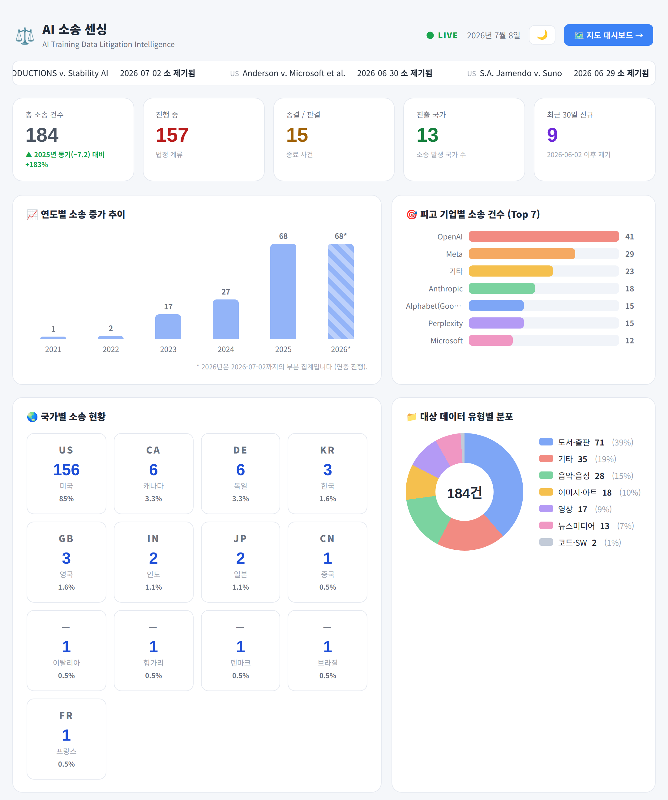
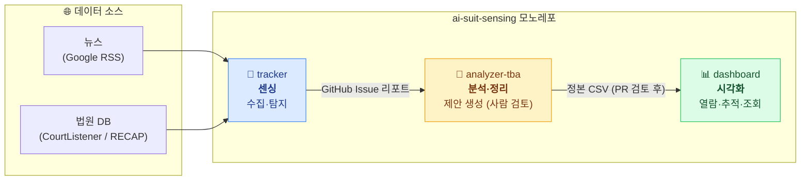
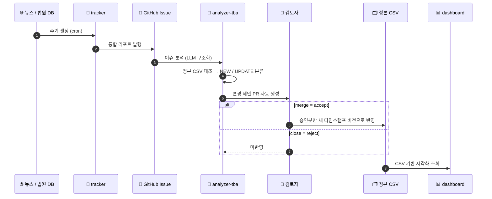
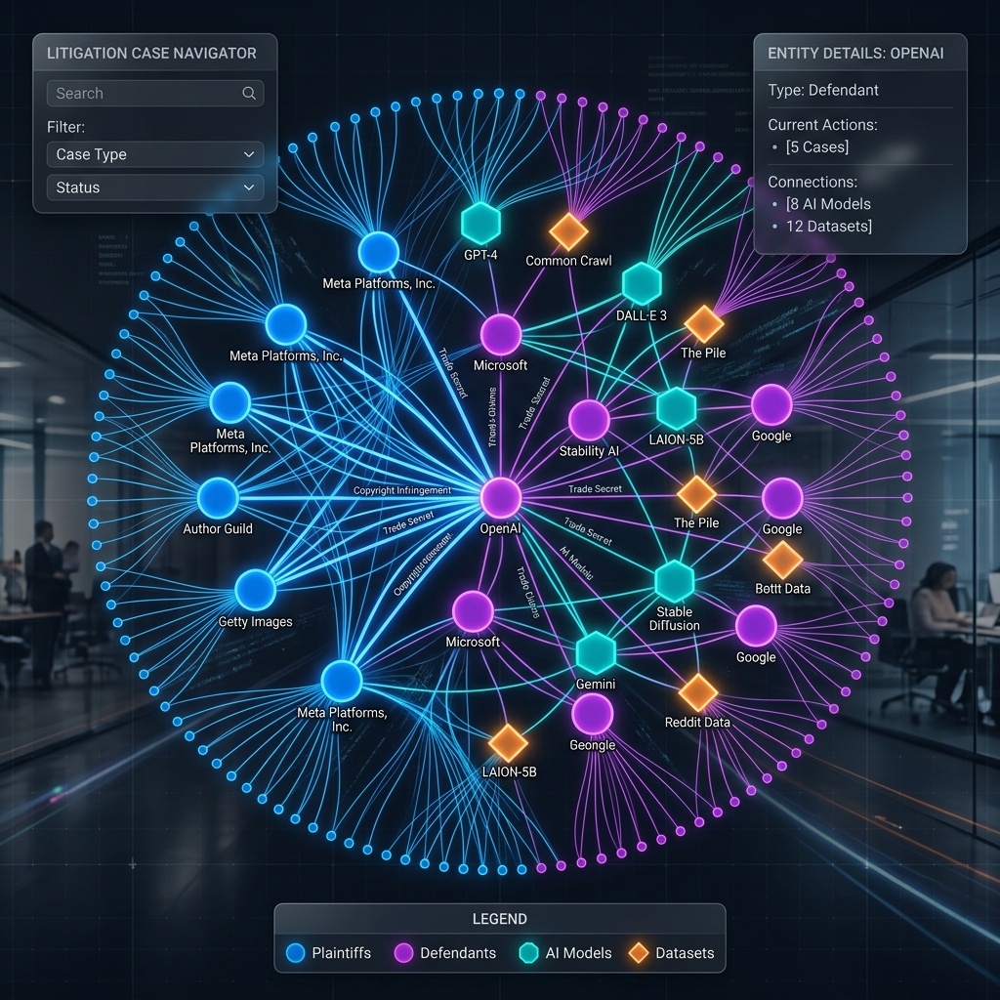
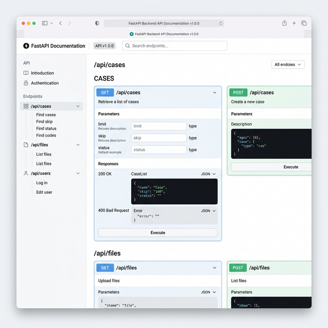

# ai-suit-sensing

> **AI 학습 데이터 무단 사용(비인가 AI 학습 데이터)에 따른 저작권 침해 소송들을 자동으로 센싱 → 분석/정리 → 시각화하는 통합 플랫폼**

뉴스와 법원 DB에서 AI 저작권 소송을 자동으로 **수집(센싱)** 하고, AI로 **분석·정리**한 뒤, 인터랙티브 대시보드로 **시각화**합니다. 기존에 분리되어 있던 두 저장소를 하나의 모노레포(monorepo)로 통합하고, 그 사이의 수동 정리 단계를 자동화하는 분석기를 추가했습니다.

<p align="center">
  
  <br>
  <em>▲ dashboard — 소송 현황 인터랙티브 히트맵</em>
</p>

---

## 🧩 한눈에 보기

세 개의 컴포넌트가 **하나의 파이프라인**으로 연결됩니다.



| 컴포넌트 | 역할 | 한 줄 설명 | 원본 저장소 |
|---|---|---|---|
| [`tracker/`](./tracker) | 📡 **센싱** | 뉴스·법원 DB에서 AI 소송을 자동 수집해 GitHub Issue/Slack 리포트로 발행 | [aigovsensing/ai-suit-tracker-v02](https://github.com/aigovsensing/ai-suit-tracker-v02) |
| [`analyzer-tba/`](./analyzer-tba) | 🧪 **분석·정리** | 이슈 리포트를 정본 CSV와 대조해 변경 제안 생성 (반영은 사람 승인 후) | 본 모노레포 신규 추가 |
| [`dashboard/`](./dashboard) | 📊 **시각화** | 정리된 CSV를 지도 히트맵·리니지 그래프·통계로 시각화 | [aigovsensing/ai-suit-dashboard](https://github.com/aigovsensing/ai-suit-dashboard) |

---

## 🤔 무엇을 먼저 써야 하나요?

목적에 따라 진입점이 다릅니다. 처음이라면 **대시보드**부터 띄워보는 것을 권장합니다.

| 하고 싶은 것 | 시작할 컴포넌트 | 바로가기 |
|---|---|---|
| 수집된 소송 데이터를 **지도/그래프로 보고 싶다** | `dashboard` | [▶ 빠른 시작](#1-dashboard--대시보드-띄우기-가장-쉬움) |
| 최신 소송을 **자동으로 수집·추적하고 싶다** | `tracker` | [▶ 빠른 시작](#2-tracker--소송-센싱-실행) |
| 수집된 이슈를 **CSV로 정리·반영하고 싶다** | `analyzer-tba` | [▶ 빠른 시작](#3-analyzer-tba--이슈를-csv로-정리) |

---

## 🚀 빠른 시작 (Quick Start)

> **공통 요구사항**: Python 3.10+ (tracker/analyzer-tba는 3.11 권장), git. 일부 AI 기능은 `GEMINI_API_KEY`가 필요합니다([Google AI Studio](https://aistudio.google.com/)에서 무료 발급).

```bash
git clone https://github.com/<owner>/ai-suit-sensing.git
cd ai-suit-sensing
```

### 1. `dashboard` — 대시보드 띄우기 (가장 쉬움)

저장소에 포함된 샘플 CSV로 즉시 시각화를 볼 수 있습니다.

```bash
# 방법 A) Docker (권장) — http://localhost:8007 접속
docker-compose -f dashboard/docker/docker-compose.yml up -d

# 방법 B) 로컬 실행
cd dashboard
pip install -r requirements.txt
uvicorn backend.main:app --host 0.0.0.0 --port 8007 --reload
```

→ 브라우저에서 **http://localhost:8007** 접속 → 상단 `DATASET`에서 데이터 선택 → 히트맵/리니지/통계 탐색.
자세한 내용은 [dashboard/README.md](./dashboard/README.md).

### 2. `tracker` — 소송 센싱 실행

로컬에서 한 번 수집해보거나, GitHub Actions로 매일 자동 실행할 수 있습니다.

```bash
cd tracker
pip install -r requirements.txt

# 최소 환경변수 (리포트 발행용)
export GITHUB_OWNER=...  GITHUB_REPO=...  GITHUB_TOKEN=...
export SLACK_WEBHOOK_URL=...        # Slack 알림용
export GEMINI_API_KEY=...           # (선택) AI 요약·의미론적 중복제거

python -m src.run
```

→ 실행하면 **GitHub Issue**와 **Slack**에 통합 리포트가 발행됩니다.
정기 자동 실행은 [`.github/workflows/lawsuit-monitor.yml`](./.github/workflows/lawsuit-monitor.yml)(스케줄)로 동작합니다.
전체 환경변수·옵션은 [tracker/README.md](./tracker/README.md).

### 3. `analyzer-tba` — 이슈를 CSV로 정리

`tracker`가 만든 GitHub Issue를 분석해 정본 CSV 변경 제안을 만듭니다.

```bash
cd analyzer-tba
pip install -r requirements.txt
export GEMINI_API_KEY=...   # LLM 추출용
export GITHUB_TOKEN=...      # 이슈 수집용

# 분석 → 제안 생성 (이 단계에서는 정본 CSV를 바꾸지 않음)
python -m src.run analyze --limit 3 --write-candidate

# CLI로 검토(accept/reject) 후 승인분만 반영
python -m src.run review proposals/changeset_<stamp>.json
python -m src.run apply  proposals/changeset_<stamp>.json
```

→ **권장 검토 방식은 GitHub PR**입니다. [`.github/workflows/analyzer-tba.yml`](./.github/workflows/analyzer-tba.yml)가 후보 CSV를 PR로 자동 생성하므로, **merge=accept / close=reject**로 검토하면 됩니다.
자세한 내용은 [analyzer-tba/README.md](./analyzer-tba/README.md)와 [구현 계획서](./analyzer-tba/implementation-plan.md).

---

## 🔄 데이터 흐름 (Data Flow)

`analyzer-tba`는 기존의 **수동 분석·정리 단계를 자동화**합니다. 단, 소송 데이터는 법적 민감 정보이므로 정본 CSV 반영 여부는 **항상 사람이 PR 검토로 결정**합니다 (*Human-in-the-Loop*).



> **핵심 원칙**: *제안은 자동, 반영은 사람 승인 후.* 빈 값은 덮어쓰지 않고(센싱 누락 보호), 변경 이력은 히스토리 컬럼에 누적하며, 정본 CSV는 덮어쓰지 않고 새 타임스탬프 버전으로 저장합니다.

---

## 📦 구성 요소 상세

### 1. [`tracker/`](./tracker) — 소송 센싱 (수집/탐지)

뉴스 사이트(Google RSS)와 소송 DB(CourtListener / RECAP)를 센싱하여, 비인가 AI 학습 데이터 관련 소송을 자동으로 추적·분석하는 도구입니다. GitHub Actions 스케줄(cron)로 주기 실행되며, 수집 결과는 **GitHub Issue**와 **Slack**으로 통합 리포트 형태로 발행됩니다.

**주요 기능**
- **다각도 소송 추적**: CourtListener(RECAP)에서 소장(Complaint/Petition) 위주로 수집하고, RSS 뉴스로 최신 소식을 보강합니다.
- **비인가 학습 감지 레벨(0~100)**: 소장 내용을 분석해 저작권 직접 언급·무단 수집·학습 직접 언급·상업적 이용 여부를 점수화/시각화합니다.
- **지능형 중복 제거(Dedup)**: 이슈 내/이슈 간 중복 제거에 더해, BM25 + Gemini Embedding 기반 의미론적 중복 제거를 수행합니다.
- **Gemini 동향 요약**: 수집 데이터를 바탕으로 트렌드 요약과 일일 시각 리포트를 생성합니다.
- **실시간 알림 & 자동 이슈 관리**: Slack 알림과 일자별 이슈 생성/마감을 자동화합니다.

**기술 스택**: Python 3.11, feedparser, requests, BeautifulSoup/lxml, pypdf, `google-generativeai` / `google-genai`(Gemini), rank_bm25

<details>
<summary>디렉터리 구성</summary>

```
tracker/
├── src/                  # 핵심 로직
│   ├── run.py              # 엔트리포인트 (python -m src.run)
│   ├── courtlistener.py    # CourtListener/RECAP 수집
│   ├── fetch.py / extract.py  # 뉴스(RSS) 수집·본문 추출
│   ├── complaint_parse.py  # 소장 파싱·감지 레벨 산출
│   ├── dedup.py            # 중복 제거(BM25 + Embedding)
│   ├── gemini.py / trend.py   # Gemini 요약·동향 분석
│   ├── github_issue.py / slack.py / email_sender.py  # 리포트 발행
│   └── render.py / stats.py   # 리포트 렌더링·통계
├── data/                 # 시드 데이터(known_cases.yml 등)
├── docs/                 # 문서 및 이미지 리포트 산출물
├── test/                 # 테스트
└── requirements.txt
```
</details>

자세한 내용은 [tracker/README.md](./tracker/README.md) 참고.

### 2. [`analyzer-tba/`](./analyzer-tba) — 센싱→정리 자동화기 (사람 검토 기반)

`tracker`가 GitHub Issue로 보고한 소송 내용을 분석하여, 기존 정본 CSV(`dashboard/data/*.csv`)와 대조하고 **신규 추가 / 기존 레코드 업데이트** 변경 제안을 생성합니다. 기존에 사람이 수동으로 하던 분석·정리 단계를 자동화하되, 소송 데이터는 법적 민감 정보이므로 **CSV 반영 전에 반드시 사람이 검토(accept/reject)** 하는 *Human-in-the-Loop* 구조입니다.

**핵심 원칙**: *제안은 자동, 반영은 사람 승인 후.*

**주요 기능**
- **이슈 분석 → 구조화**: Gemini로 이슈 텍스트에서 소송 레코드를 추출하고, 도켓번호 정규식·스키마 검증으로 환각을 차단합니다.
- **정본 CSV 대조**: 도켓번호(소송번호)→System ID→사건명 퍼지매칭 우선순위로 `NEW` / `UPDATE` / `UNCHANGED`를 분류합니다.
- **변경 제안(changeset) 생성**: 필드 단위 before→after 와 신뢰도를 담은 제안을 만들되, 이 단계까지는 정본 CSV를 변경하지 않습니다.
- **검토 방식 A(권장): GitHub PR** — 후보 CSV를 PR로 자동 생성, **merge=accept / close=reject**. git 이력으로 감사 추적·되돌리기가 가능합니다.
- **검토 방식 B(보조): CLI** — `review`(accept/reject) → `apply`(승인분만 반영).
- **안전한 반영**: 빈 값은 덮어쓰지 않고(센싱 누락 보호), 변경 이력은 히스토리 컬럼에 누적하며, 정본 CSV는 덮어쓰지 않고 새 타임스탬프 버전으로 저장합니다.

**기술 스택**: Python 3.11, `google-generativeai`(Gemini), pandas, rapidfuzz, GitHub REST / Actions

<details>
<summary>디렉터리 구성</summary>

```
analyzer-tba/
├── implementation-plan.md  # 설계/로드맵
├── config.yaml             # 경로·임계값·모델 설정
├── src/
│   ├── ingest.py             # GitHub Issue + 댓글 수집
│   ├── extract.py            # 이슈 텍스트 → 구조화 레코드(Gemini + 검증)
│   ├── csv_store.py          # 정본 CSV 로드/저장(round-trip)
│   ├── matcher.py            # NEW/UPDATE/UNCHANGED 분류
│   ├── diff.py / changeset.py # 변경 계산·제안 직렬화
│   ├── apply.py / report.py  # 승인분 반영·PR 본문 생성
│   └── run.py                # CLI (analyze/review/apply)
└── tests/                  # round-trip / 파이프라인 E2E 테스트
```
</details>

자세한 내용은 [analyzer-tba/README.md](./analyzer-tba/README.md) 와 [구현 계획서](./analyzer-tba/implementation-plan.md) 참고.

### 3. [`dashboard/`](./dashboard) — 소송 현황 시각화 (열람/추적/조회)

`tracker`가 센싱하고 `analyzer-tba`(또는 사람)가 정리한 소송 데이터를 `data/*.csv` 파일로 저장하면, `dashboard`는 이 `.csv` 데이터를 기반으로 소송 현황을 **열람·추적·조회**하고, 지도 히트맵·리니지 그래프·통계로 **시각화**하는 분석 플랫폼입니다.

**주요 기능**
- **인터랙티브 소송 히트맵**: 대륙별 줌인과 피고·학습 데이터 분야(Theme)별 다차원 필터링을 제공합니다.
- **리니지 그래프(Lineage)**: 원고·피고·데이터셋·AI 제품 간 관계를 시각화하고 특정 대상 포커싱 분석을 지원합니다.
- **통계 & 시계열 추이**: 청구 내용·피고·판결 결과별 실시간 집계와 시계열 트렌드 차트를 제공합니다.
- **Gemini 월간 보고서**: 소송 데이터 기반 법적 트렌드 보고서를 자동 생성합니다.
- **UX**: 다국어(KO/EN), 반응형 디자인, 최신 데이터셋 자동 시각화를 지원합니다.

**기술 스택**: FastAPI(Python 3.10+) + Uvicorn, MariaDB(또는 SQLite fallback), Vanilla JS / React 18 / Cytoscape.js, Gemini API, Docker / docker-compose

| 메인 대시보드 & 히트맵 | 소송 관계 리니지 그래프 | 통계 분석 & AI 보고서 |
| :---: | :---: | :---: |
|  |  |  |

<details>
<summary>디렉터리 구성</summary>

```
dashboard/
├── backend/      # FastAPI 라우터 및 비즈니스 로직 (main.py)
├── collector/    # 데이터 수집·정제(ELT): courtlistener / builder / processor / storage
├── data/         # 소송 데이터 CSV (aisuit_YYYYMMDD[_HHMM].csv)
├── database/     # 스키마(schema.sql) 등 DB 정의
├── frontend/     # 대시보드 UI (지도/그래프/통계)
├── timeline/     # 타임라인 시각화
├── docker/       # Docker / docker-compose 구성
├── scripts/      # 운영 스크립트
└── requirements.txt
```
</details>

자세한 내용은 [dashboard/README.md](./dashboard/README.md) 참고.

---

## 🗂️ 저장소 구조

```
ai-suit-sensing/
├── tracker/        # 소송 센싱 도구 (CourtListener/RECAP & News Extractor)
├── analyzer-tba/   # TBA: 센싱→정리 자동화기 (사람 검토 기반, PR 워크플로우)
├── dashboard/      # 소송 현황 대시보드 (AI Litigation Dashboard)
├── .github/workflows/
│   ├── lawsuit-monitor.yml   # tracker 자동 센싱 (스케줄)
│   └── analyzer-tba.yml      # analyzer-tba 제안 → PR 생성 (수동/스케줄)
├── LICENSE
└── README.md
```

각 하위 프로젝트의 설치/실행 방법, 환경 변수, 기술 스택은 해당 디렉터리의 `README.md`를 참고하세요.

## 📄 라이선스

[LICENSE](./LICENSE) 파일을 참고하세요.
